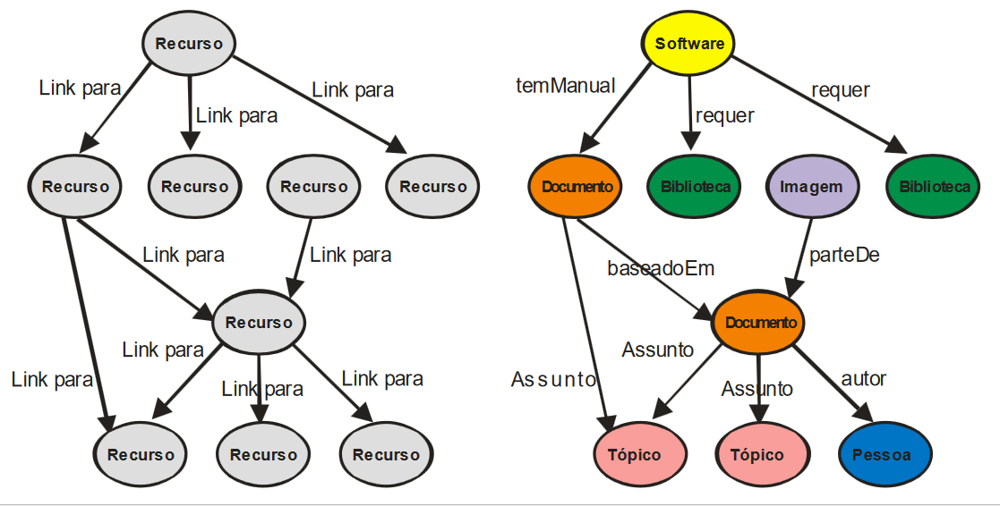
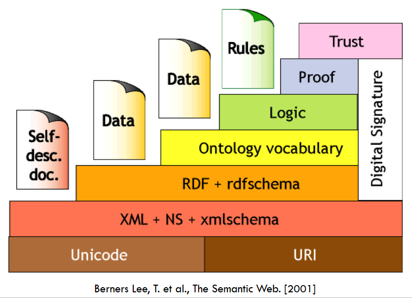

# Organização de Informação

## Índice
1. Conceitos Básicos. (Feito)
2. Dados Estruturados e BD. (Feito)
3. Modelagem de Dados.
4. HTML/XML e Sistemas Hipermídia. (Feito)
5. Web Semântica. (Feito)
6. Metadados. (Feito)

<!--
=
=
=
=
-->
## 1 - Conceitos Básicos

### Dado
“Dados são a coleção de evidências relevantes sobre um fato observado.”

Normalmente não tratamos de um dado isoladamente.

Exemplo: Passar crachá na roleta.
- Registro de Trâmite
>Matrícula: 98.652
>  
>Data: 16/03/2010
>  
>Hora: 11:27
>  
>Dispositivo: 14AB

### Informação
Informação é a *interpretação de um conjunto de dados* segundo um propósito relevante e de consenso para o público-alvo.”

- Fruto da manipulação, consolidação e organização dos dados.

Exemplo: Trâmite do Funcionário.

- Tenho a matrícula e as horas de entrada e saída.
>Total de horas trabalhadas pelo funcionário no mês?
>
>Número de horas extras do funcionário?

### Conhecimento
“Conhecimento é o novo saber, resultante de análises e reflexões de informações segundo valores e modelo mental daquele que o desenvolve, proporcionando a este melhor capacidade adaptativa às circunstâncias do mundo real.”

- É individual: insumos são os mesmos mas modelo mental e valores são únicos.

### Dado __x__ Informação __x__ Conhecimento
- Dados: Material bruto e não formatado.
- Informação: Dado processado.
- Conhecimento: Informação incorporada pela pessoa.

  #### Exemplo
  - Dados:
    - Registro da quantidade de peças produzidas.
    - Registro da quantidade de refugo gerado.
  - Informação:
    - Identificação das linhas em atraso.
    - Identificação de alto nível de refugo em uma linha em um período do ano.
  - Conhecimento:
    - Descoberta da maior sensibilidade do material em relação a determinado nível de umidade do ar.

  #### Definições
  - Conhecimento
    - Explícito: Conhecimento externalizado e formalizado na instituição: documentos, manuais, regras, atas, etc.
      - Exemplos:
        - Informações sobre o trânsito.
        - Informações sobre a meteorologia.
        - O papel da tecnologia (GPS com um mapa da cidade).
    - Tácito: O que está na cabeça das pessoas, não formalizado: práticas, experiência pessoal, aprendizado, etc.
      - Exemplos:
        - Ensine alguém como se anda de bicicleta?
        - Se você tem uma reunião as 9:15 e não pode se atrasar, a que horas você deve sair de casa?

### Espiral do Conhecimento
| x | Tácito | Explícito |
| :---: | :---: | :---: |
| **Tácito** | Socialização | Externalização |
| **Explícito** | Internalização | Combinação |

- Socialização (Tácito/Tácito):
  - Brainstorming
  - Observação
  - Prática
  - Integração
- Externalização (Tácito/Explícito):
  - Dedução
  - Metáfora
  - Analogia
- Internalização (Explícito/Tácito):
  - Incorporação
  - Verbalização
  - Diagramação
- Combinação (Explícito/Explícito):
  - Sistematização
  - Classificação
  - Ensino

  <!--

  =   =
  =   =
  =   =
  =   =

  -->
## 2 - Dados Estruturados e BD

### Dados Não Estruturados
- Dados podem ser de qualquer tipo.
- Não seguem sequência ou formato.
- Não seguem regras.
- Não são previsíveis.

- Exemplos
  - Texto
  - Vídeo
  - Som
  - Imagens

### Dados Estruturados
- Dados estão organizados em blocos semânticos (**Entidades**).
- Entidades similares estão agrupadas (**Relações** ou **Classes**).
- Entidades do mesmo grupo tem a mesma descrição (**Atributos**).
- Descrição para todas as entidades em um grupo (**Schema**/**Esquema**).

### Banco de Dados
Um banco de dados é uma coleção *integrada* e *estruturada* de dados operacionais usados (compartilhados) por sistemas de uma organização.

|   |   |
| --- | --- |
| Manufacturing | Product Data |
| University | Student data, Courses |
| Hospital | Patient data, Facilitites |
| Bank | Account data |

### O que faz um Banco de Dados?
- Gerencia grandes quantidades de dados.
- Apoia acesso *eficiente*, *concorrente* e *seguro* aos dados.

### Conceitos Básicos
- Dado: Fato do mundo real que está registrado.
  - Exemplos: Endereço, Data.
- Informação: Fato útil que pode ser extraído direta ou indiretamente a partir dos dados.
  - Exemplos: Endereço de Entrega, Idade.
- Banco de Dados (BD): Coleção de dados inter-relacionados e persistentes que representa um subconjunto dos fatos presentes em um domínio de aplicação (universo de discurso).

### O que é um Banco de Dados?
- Um banco de dados (BD) é uma coleção *estruturada* de dados sobre as entidades existentes no ambiente que está sendo modelado.
- A estrutura é determinada por um modelo abstrato de dados.
- Um sistema gerenciador de banco de dados (SGBD) é a ferramenta geral que facilita a gestão e acesos ao banco de dados.

<!--

=   =   =
=   =   =
=   =   =
=   =   =

-->
## 3 - Modelagem de Dados

### Modelos de Dados


<!--

=   =     =
=    =   =
=     = =
=      =

-->
## 4 - HTML/XML e Sistemas Hipermídia

### Sistemas Hipermídia
> Sistemas que manipulam um conjunto de informações, pertencendo a vários tipos de mídia (texto, som, imagem, etc.), podendo estas informações serem lidas de forma não-linear através dos diversos caminhos de acesso disponíveis.

### Principais Características
- Modularidade e associação baseada no conteúdo.
- Flexibilidade de expansão.
- Interface amigável.
- Apresentação dinâmica.
- **O leitor pode escolher diferentes sucessores para uma ideia.**

### World Wide Web
- A World Wide Web (Web ou WWW) é, grosso modo, uma interface gráfica para a Internet.
- A ideia básica é criar um universo de informações sem fronteiras, prevendo as seguintes características:
  - Interface consistente;
  - Incorporação de um vasto conjunto de tecnologias e tipos de documentos;
  - "leitura universal".
- para isso, implementa três fatores importantes:
  - Um protocolo de transmissão de dados - *HTTP*;
  - Um sistema de endereçamento próprio - *URL*;
  - Uma linguagem de marcação, para transmitir documentos formatados através da rede - *HTML*.

### Navegação
Navegador da Web
- Você requisita uma página da web ou arquivo em seu navegador.

Domain Name Service
- DNS checa o nome do domínio do site e busca o endereço em seu servidor da Web.

Hosted Web Server
- O servidor da Web envia de volta a informação da página da Web requisitada ou arquivo requisitado para o Navegador.

### URL
> **Uniform Resource Locator** (Localizador Uniforme de Recursos): é baseado em uma sintaxe chamada URI - Universal Resource Identifier (Identificador Uniforme de Recursos) que serve para localizar recursos de uma maneira uniforme.

Exemplo: http://www.dcc.ufrj.br/index.html

O endereço identifica:
- Protocolo de acesso ao recurso desejado - *http*;
- Máquina a ser conectada - *www.dcc.ufrj.br*;
- Caminho do diretório - */docentes*;
- Recurso/Arquivo a ser obtido - *index.html*.

### HTML
**Hyper Text Markup Language**. Uma especificação definida pelo [consórcio W3C](w3.org). Um arquivo HTML possui marcadores (tags) que indicam para o navegador (browser) como a página deve ser apresentada. Esses marcadores usualmente vem em pares, como `<tag>Conteúdo<\tag>`, mas também podem aparecer de forma abreviada, como `<tag atributo="valor" Conteúdo />`.

### XML
**eXtensible Markup Language** (Linguagem de Marcador Extensível) É uma linguagem de marcação. Utilizada para *transferir*, não mostrar, *dados*. Suas tags, diferente do HTML, não são pré-definidas, mas definidas pelo autor. É auto descritiva.

Não "faz" nada. Foi criado para estruturar, armazenar e transportar informação. Informação pura é "embrulhada" em tags.

Exemplo:
```xml
<note>
<to>Tove</to>
<from>Jani</from>
<heading>Reminder</heading>
<body>Don't forget me this weekend!</body>
</note>
```
  #### Por que XML?
  - HTML foi projetado para **mostrar** documentos em um browser e nada mais.
    - É difícil mostrar documentos em dispositivos móveis ou traduzir o conteúdo para outro idioma.
  - Propósito do HTML é permitir a criação rápida de documentos web. XML pode ser usado em diferentes contextos que podem não ter nada a ver com interação com humanos (Ex.: Serviços Web usam XML).
  - HTML raramente dá informação sobre a estrutura do documento ou o que ele significa.
    - HTML é uma linguagem de apresentação, XML é uma linguagem de descrição de dados.
  - HTML puro resulta na mistura de dados e apresentação.

<!--

=     =
 =   =
  = =
   =

-->
## 5 - Web Semântica

### Cenário Atual
Internet produz um problema de manipulação de informação: Possui um grande volume de informação pouco ou não estruturada.

Alguns dos grandes problemas são:
- *Consulta*: Encontrar o que deseja;
- *Integração*: Integrar informações de várias fontes;
- *Interpretação*: Extrair significado das páginas;
- *Comunicação*: Interconectar sistemas.

Resumindo, o conteúdo pode ser *lido*, mas é difícil de ser *processado* pela máquina, dificultando a automatização de processos.

### Solução
A solução seria descrever os dados contidos na web de forma conveniente.

Como captar a semântica do conteúdo das páginas da web?
  - Dotar os sistemas de inteligência e autonomia.
  - Fazer com que as páginas possuam uma semântica clara e definida.

As ontologias tem papel fundamental em ambas as soluções.

### Web Semântica
Evolução da web atual.
> "É a ideia de se ter dados na web definidos e ligados de maneira tal que possam ser usados por máquinas não só com o objetivo de apresentação, mas para automação, integração e reuso de dados entre aplicações." - Definição da W3C, idealizada por Tim Berners-Lee.

É uma tentativa de construir uma estrutura complexa que permita que os computadores nos auxiliem na manipulação  da informação.
- Esforço na produção de metadados.
- Padronização de vocabulários.
- Massa crítica.
- Formalismos complexos (demanda para boas ferramentas).

### Web Atual __x__ Web Semântica


### Camadas W3C


<!--

=     =   =
 =   =    =
  = =     =
   =      =

-->
## 6 - Metadados

### Por que organizar?
Questão de escala:
- Usar suas próprias categorias e métodos (ad hoc) para organizar sua coleção de livros ou CDs parece funcionar bem...
- ...mas apenas até certo ponto.
- Difícil gerenciar coleções muito grandes e mudanças.
  - 10 vezes maior?
  - 100 vezes?
  - 1000 vezes?
  - 10000 vezes?

### Processo de Organização
- Identificar a existência dos tipos de entidades atreladas à informação à medida que fiquem disponíveis.
- Sistematicamente juntar estas entidades em coleções em bibliotecas, arquivos, museus, arquivos na Internet e outros repositórios.

### Produtos da Organização
- Produção de listas de entidades de acordo com regras padronizadas.
- Fornece nome, título, abstract e outras formas úteis para acesso a essas entidades.
- Fornece meios para localizar cada entidade ou uma cópia dela.

### Metadados
Estruturas e linguagens para a descrição de recursos de informação e seus elementos (*componentes* ou *características*).
>"Metadados são informações sobre a organização dos dados, os vários domínios de dados, e o relacionamento entre eles." - Baeza-Yates p.142

Frequentemente distinguimos 2 principais tipos de metadados:
- Descritivos:
  - Descreve o objeto de informação/dados e suas propriedades.
  - Pode usar uma variedade de formatos e regras descritivas.
- Tópicos:
  - Descreve o tópico ou "sobre que" de um objeto de informação/dados.
  - Pode incluir uma variedade de vocabulários para descrição de assuntos, tópicos, categorias, etc.

### O Problema do Vocabulário
Pessoas usam uma grande variedade de palavras para a mesma coisa ou conceito e acham que suas escolhas são "naturais". Esta grande na seleção de palavras é um fato inescapável que tem raízes na natureza da linguagem e na categorização.

### Vocabulários Controlados
Controle de vocabulário e uma tentativa de fornecer um conjunto consistente e padronizado de termos (Ex.: Cabeçalhos, Nomes, Classificações, etc.) com a intenção de auxiliar o usuário a encontrar informação. Um *conjunto consistente de descrições* para serem utilizados como metadados.

  #### Vocabulário Controlado
  - Conjunto de termos padrão para determinado domínio ou contexto.
  - Exemplos de uso:
    - Padronização de termos em BDs para, por exemplo, domínios de palavra chave.
    - Descritores em ambientes de GED.
    - Base de esquemas de classificação (Biologia, Bibliotecas, Museus, etc.).
    - Hashtags.

### Taxonomias
> "Vocabulário controlado e dinâmico de descritores relacionados com semântica e genericamente, que cobre de forma extensiva um ramo do conhecimento." - Dicionário Aurélio

O termo 'Taxonomia' vem do grego. É a junção dos termos "taxis", que significa "arrumação", e "nomos", que significa "lei".

Conceito:
- Ferramentas de organização intelectual.
- Atuam como mapa conceitual de um domínio de ?
- Possibilitam a recuperação de dados e informações através de navegação.
